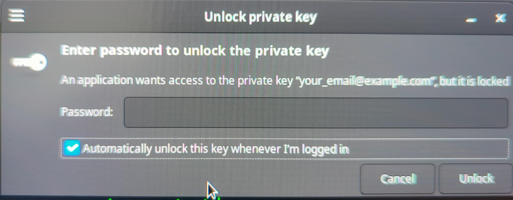

# Create/Save SSH passphrase credentials to Debian Password Manager [Seahorse]

Only work on a debian with a desktop environment and [Seahorse](https://wiki.debian.org/Seahorse)

[The Difference Between Ed25519 vs RSA](https://www.reviewplan.com/ed25519-vs-rsa/)
```bash
ssh-keygen -t ed25519 -C "your_email@example.com"

ssh-keygen -t rsa -b 4096 -C "your_email@example.com" # if the above doesn't work
 
# authenticating against a server that has your public key [~/.ssh/id_ed25519.pub] in ~/.ssh/authorized_keys
ssh user@server
```

